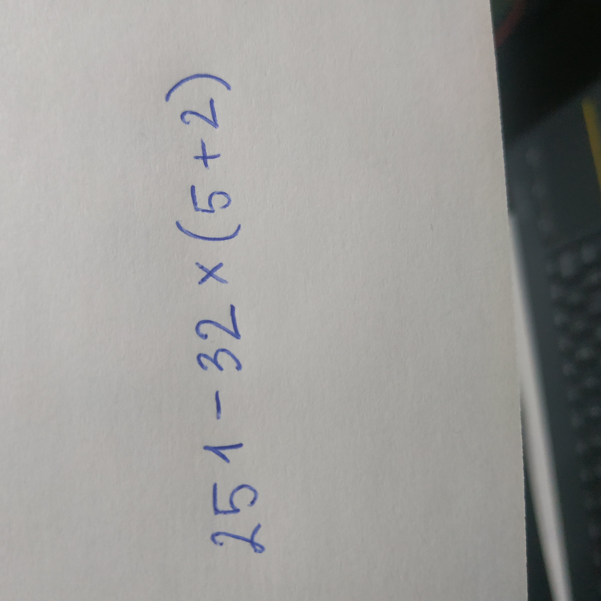
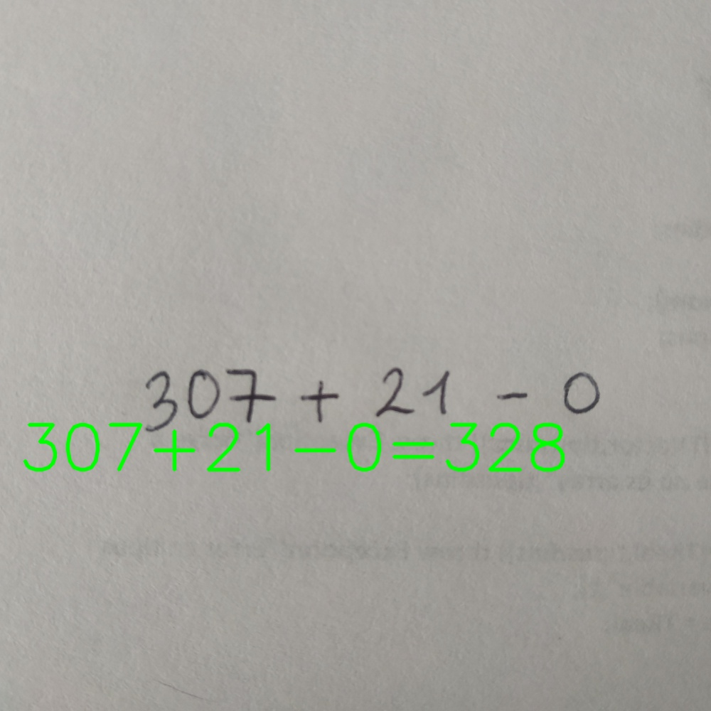

# Handwritten math expressions solver :heavy_plus_sign: :heavy_minus_sign: :heavy_multiplication_x: :heavy_division_sign:

### **[WARNING:exclamation::exclamation::exclamation: A refactor over the code is pendant in order to ease the understanding of it. Also, the repository will be split in 2: one for the application using the trained model and a second one for the training framework]** 

This is a *Computer Vision* project I made trying to check the use of **Convolutional Neural Networks** in a Python project.
Just as the title says, this project builds a module able to solve basic mathematical expressions included by an input image. 

<p align="center">
  
  
</p>

## :small_blue_diamond: What can we do with this module? 
The program operation is simple, just run the **main.py** file setting the input image as an argument on the command line:

```console
erickgualpa@erickgm:~$ python main.py ./testing_imgs/c.jpg
```

This will begin image processing and in case it has some expression, a new image will be saved in the 
**testing_imgs_results/** directory including the expression detected and the result. 

The second thing we can do with this is try to add new mathematical symbols to the classifier and train it. The current version only
supports the basic operations such as *addition, substraction, multiplication and division* (all of them being able to include 
*parenthesis* and *claudators*).

## :small_blue_diamond: Adding new symbols and training the classifier
The dataset used to train the classifier is a reducted version of this one: [Handwritten math symbols dataset](https://www.kaggle.com/xainano/handwrittenmathsymbols/data)

The files assigned to the Classifier training ara **digits_symbols_classifier_cnn.py** and **DigitsSymbolsDataset.py**. The second one is the file you may edit if you want to add a different dataset. 

There is another one, **digits-symbols-mapping.json** where is placed the mapping between the dataset classes
and value of each class in the way of how is this proccessed inside the module. 

To start the training you may run the **digits_symbols_classifier_cnn.py** setting the parameters *batch size* and *epochs*:

```console
erickgualpa@erickgm:~$ python digits_symbols_classifier_cnn 64 5
```

This will load the dataset, build the classifier using the mapped set previously and save the classifier in the **classifiers/** directory.
