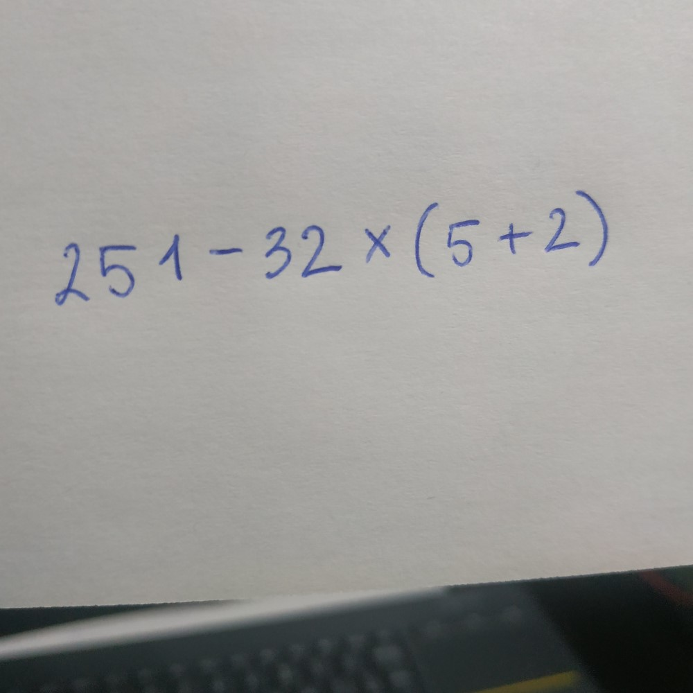
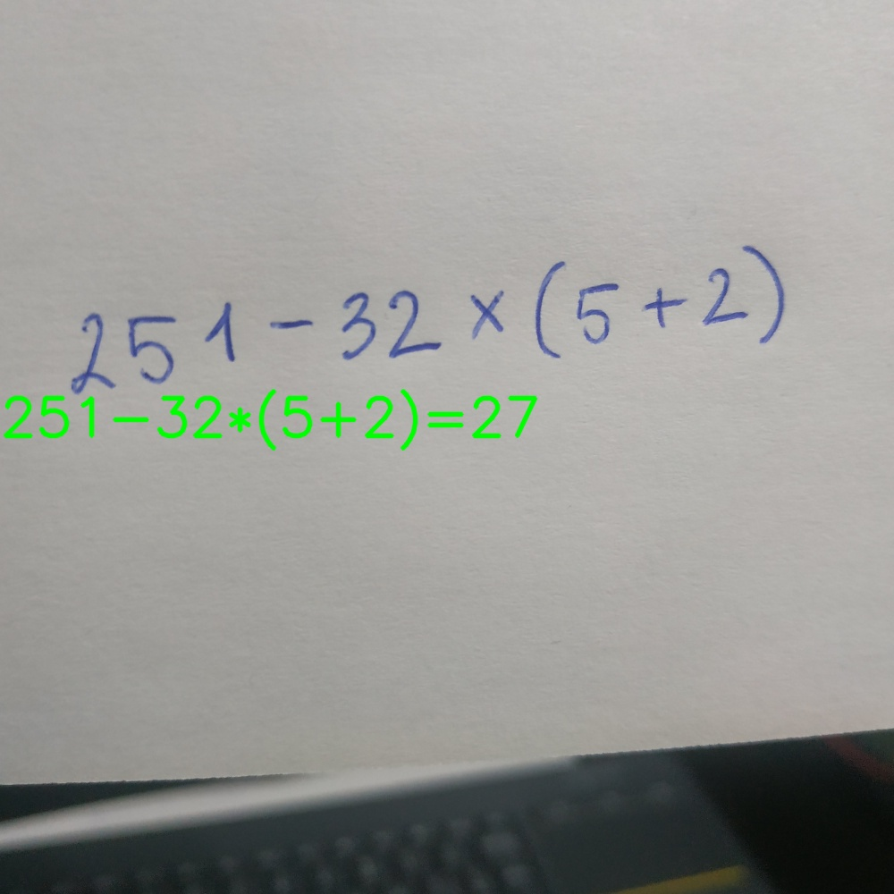

# Handwritten math expressions solver
This is a *Computer Vision* project I made, for trying to test myself in the use of **Convolutional Neural Networks** in a Python project.
Just as the title says, this project builds a module able to solve basic mathematical expressions inside an input image. 

  
  

## What can we do with this module?
The program operation is so simple, you only have to put the image you want inside the **testing_imgs/** directory, set it in the code
and run the **main.py** file. This will begin the image processing and in case it has some expression, a new image will be saved in the 
**testing_imgs_results/** directory including the expression detected and the result. 

The second thing we can do with this is try to add new mathematical symbols to the classifier and train it. The current version only
supports the basic operations such as *addition, substraction, multiplication and division* (all of them being able to include 
*parenthesis* and *claudators*)

## Adding new symbols and training the classifier
The dataset used to train the classifier is a reducted version of this one: [Handwritten math symbols dataset](https://www.kaggle.com/xainano/handwrittenmathsymbols/data)

The files assigned to the Classifier training ara **digits_symbols_classifier_cnn.py** and **DigitsSymbolsDataset.py**. The second one is the
file you may edit if you want to add a different dataset. 

There is another one, **digits-symbols-mapping.json** where is placed the mapping between the dataset classes
and value of each class in the way of how is this proccessed inside the module. 

To start the training you have to run the **digits_symbols_classifier_cnn.py** (here you can set the number of *epochs* and the
*batch size*) and this will load the dataset, build the classifier using the mapped set previously and save the classifier in 
the **classifiers/** directory
